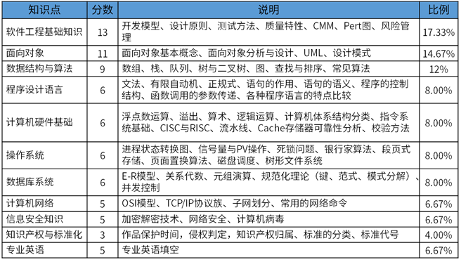

# china_ruankao_midexam_softdeisg 软考中级-软件设计师通关路径
This is some paper of  prepare the exam in China of ruankao which is software Designer.这是一个为准备中国的IT资格考试软考中级-软件设计师-收集的一些资料

## 1. 自己在规定时间内刷一套最近年份的真题

**目的：了解考试题型,考的知识点，对自己的知识能力有一个相对的了解**

考试通过标准：

| 考试项目 | 考试时长 | 题型题量 | 满分 | 合格标准 |
| ---- | ---- | ---- | ---- |---- |
| 综合知识 | 150min (9:00--11:30) | 单选题（75道） | 75分 | 45分 |
| 案例分析 | 150min (14:00--16:30) | 案例分析 | 75分 | 45分 |

基于自己的刷题情况，继续后续流程。

## 2. 上午综合知识查漏补缺。(2个月内完成)

上午题，考试知识点分布如下图：

1. 知识点不懂的，推荐 B站 王勇老师讲授的知识点讲解

<i>因此视频有版权,故链接不稳定。但是按关键字 [**软件设计师**] 一般都能搜索到。全视频一共195个分P。</i>

***王勇老师语速较慢，建议 1.5 倍速以上播放。***

2. 刷app上的真题：

真题 app 推荐【软考通】。自行下载后，自己定计划去刷。

*真题 app 和视频的章节划分有所不同，但大致可以对应。*

**提醒软考组织，从未公布过真题答案，很多答案也是相对正确。请自行甄别**

3.查教程
遇到答案有疑问的情况，可以翻看教程对应章节。

**建议二个月内完成，并适当记录自己的知识点笔记或截屏**。

## 3. 下午案例分析掌握套路答题（2周）

下午的应用技术题型是固定的，共 6 道题，最后两道二选一：

1. 结构化分析与设计，考查数据流图 DFD 和汉语阅读理解
2. 数据库的分析和设计，考查 ER 图与关系模式 和汉语阅读理解
3. 面向对象分析与设计，考查常用 UML 图 和汉语阅读理解
4. 常用算法，考察结合算法的C语言编码能力
5. 设计模式（C++ 和 Java 二选一），考查Java的基础编码能力

在这一步，我们可以一次复习一种题型对应的视频，了解答题套路。然后，一次大量练习攻克【**一种题型**】。

例如看了数据流图相关的视频后，我们可以把多年的数据流图真题都打印出来，一次性吃透数据流图题。

每种题型花费 2~3 天，

*给大家收集了09年到21年的真题，有pdf和word版本的。Word版本只有答案，没有解析。pdf的有解析。*

*还是需要注意甄别答案的正确性**

**建议 15 天内完成**。

## 4. 考前一周刷整卷

最后一周，刷真题，保持题感。强化背诵自己的知识点卡片。

最后，祝大家都顺利一次过考。good luck 😁

*这些资料，取之于github,还之于github。如果您有新的资料希望补充进来，可以提交PR。谢谢！*

